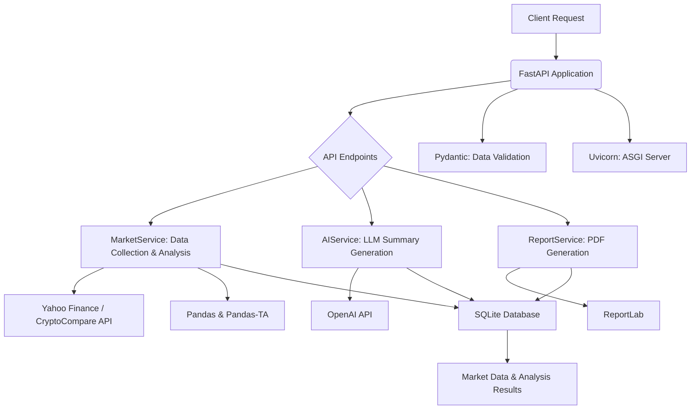

# AI Market Trend Analyzer

## 📌 Overview

The **AI Market Trend Analyzer** is a sophisticated and scalable system engineered for real-time market data acquisition, advanced trend analysis, and intelligent summarization using Large Language Models (LLMs). This robust application, built with FastAPI, provides a comprehensive web API that facilitates the initiation of market analyses and the retrieval of detailed results, including professionally formatted PDF reports. It is designed to offer deep insights into various financial markets, including Stocks, Cryptocurrencies, and Forex.

## ⚙️ Features

*   **Real-time Market Data Collection**: Gathers up-to-the-minute financial data from diverse sources for Stocks, Cryptocurrencies, and Forex markets.
*   **Advanced Technical Analysis**: Employs a suite of technical indicators (e.g., RSI, SMA) to identify and interpret market trends and patterns.
*   **AI-Powered Trend Summarization**: Utilizes Large Language Models (LLMs) to generate concise and insightful summaries of market trends, making complex data easily digestible.
*   **RESTful API Interface**: Offers a well-documented and intuitive API for seamless integration and programmatic access to analysis functionalities.
*   **Professional PDF Report Generation**: Creates detailed and visually appealing PDF reports that encapsulate market data, technical analysis, and AI-generated summaries.
*   **Scalable Architecture**: Built on FastAPI, ensuring high performance and scalability to handle extensive data processing and concurrent requests.
*   **Data Persistence**: Stores market data and analysis results in a SQLite database for historical tracking and efficient retrieval.

## 🛠 Tech Stack

*   **Backend Framework**: FastAPI (Python 3.10+)
*   **Data Analysis**: Pandas, Pandas-TA
*   **AI/ML Libraries**: OpenAI API (for Large Language Models)
*   **Database**: SQLite
*   **PDF Generation**: ReportLab
*   **Web Server**: Uvicorn (ASGI)
*   **Dependency Management**: `pip`
*   **Environment Management**: `venv`

## ▶️ How to Run (for Termux/Linux Users)

To set up and operate the AI Market Trend Analyzer on your Termux or Linux environment, please follow these comprehensive instructions:

### Prerequisites

*   **Python 3.10+**: Ensure Python version 3.10 or newer is installed.
*   **`pip`**: The Python package installer should be available.
*   For Termux users, install Python and pip using `pkg install python`.

### Installation Steps

1.  **Clone the Repository**:
    ```bash
    git clone https://github.com/salah619/AI-Market-Trend-Analyzer.git
    cd AI-Market-Trend-Analyzer
    ```

2.  **Create and Activate a Virtual Environment** (Highly Recommended for dependency isolation):
    ```bash
    python3 -m venv venv
    source venv/bin/activate  # For Linux/Termux
    # On Windows, use `venv\Scripts\activate`
    ```

3.  **Install Required Dependencies**:
    ```bash
    pip install -r requirements.txt
    ```

4.  **Configure Environment Variables**:
    Create a `.env` file in the project's root directory and add your OpenAI API key. This key is essential for the AI summarization feature.
    ```
    OPENAI_API_KEY="YOUR_OPENAI_API_KEY"
    ```
    *Replace `YOUR_OPENAI_API_KEY` with your actual OpenAI API key, obtainable from the [OpenAI Platform](https://platform.openai.com/).*

### Running the Application

To launch the FastAPI application, execute the following command from the project's root directory:

```bash
uvicorn app.main:app --host 0.0.0.0 --port 8000 --reload
```

The API will be accessible, and its interactive documentation (Swagger UI) can be viewed at `http://localhost:8000/docs` in your web browser.

## 📈 Usage Examples

### Analyze Market Trend

Initiate a market trend analysis by sending a POST request to the `/api/v1/analyze` endpoint. Specify the asset symbol, historical period, and data interval.

**Request Example (using `curl`):**

```bash
curl -X POST "http://localhost:8000/api/v1/analyze" \
-H "Content-Type: application/json" \
-d '{
  "symbol": "AAPL",
  "period": "1mo",
  "interval": "1d"
}'
```

**Response Example:**

```json
{
  "symbol": "AAPL",
  "current_price": 170.00,
  "rsi": 55.25,
  "sma_20": 168.50,
  "sma_50": 165.75,
  "trend": "Bullish",
  "ai_summary": "The market for AAPL shows a bullish trend...",
  "timestamp": "2023-10-27T10:00:00.000000"
}
```

### Generate PDF Report

To obtain a comprehensive PDF report for a specific asset, send a GET request to the `/api/v1/report/{symbol}` endpoint.

**Request Example (using `curl` to download):**

```bash
curl -X GET "http://localhost:8000/api/v1/report/AAPL" -o AAPL_report.pdf
```

This command will download a PDF file named `AAPL_report.pdf`, containing the detailed market analysis and AI-generated summary for the specified asset.

## 🏛 Architecture Diagram



## 📄 License

This project is licensed under the MIT License. See the `LICENSE` file for details.
