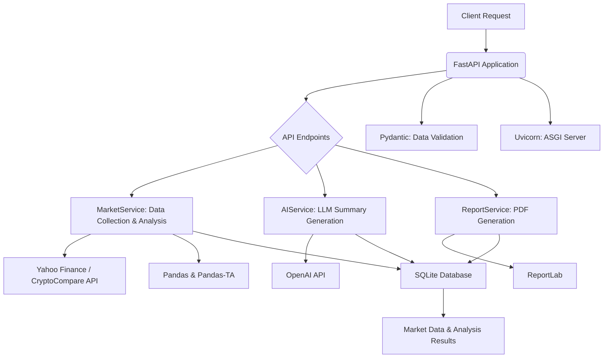

# AI-Market-Trend-Analyzer

## Project Overview

This project, **AI-Market-Trend-Analyzer**, is a robust and scalable system designed to collect real-time market data (Stocks, Cryptocurrencies, Forex), analyze trends using technical indicators, and generate AI-powered summaries using Large Language Models (LLMs). Built with FastAPI, it provides a web API to trigger analysis and view results, including professional PDF reports.

Developed by Engineer Salah Al-Wafi.

## Architecture Diagram



## Setup Instructions

### Prerequisites

*   Python 3.10+
*   `pip` (Python package installer)

### Installation

1.  **Clone the repository:**

    ```bash
    git clone https://github.com/YOUR_GITHUB_USERNAME/AI-Market-Trend-Analyzer.git
    cd AI-Market-Trend-Analyzer
    ```

2.  **Create a virtual environment (recommended):**

    ```bash
    python3 -m venv venv
    source venv/bin/activate  # On Windows, use `venv\Scripts\activate`
    ```

3.  **Install dependencies:**

    ```bash
    pip install -r requirements.txt
    ```

4.  **Configure Environment Variables:**

    Create a `.env` file in the root directory of the project and add your OpenAI API key:

    ```
    OPENAI_API_KEY="YOUR_OPENAI_API_KEY"
    ```

    *Replace `YOUR_OPENAI_API_KEY` with your actual OpenAI API key.*

### Running the Application

To start the FastAPI application, run the following command from the project root directory:

```bash
uvicorn app.main:app --host 0.0.0.0 --port 8000 --reload
```

The API documentation will be available at `http://localhost:8000/docs`.

## Usage Examples

### Analyze Market Trend

Send a POST request to the `/api/v1/analyze` endpoint with the desired symbol, period, and interval.

**Request:**

```bash
curl -X POST "http://localhost:8000/api/v1/analyze" \
-H "Content-Type: application/json" \
-d '{
  "symbol": "AAPL",
  "period": "1mo",
  "interval": "1d"
}'
```

**Response Example:**

```json
{
  "symbol": "AAPL",
  "current_price": 170.00,
  "rsi": 55.25,
  "sma_20": 168.50,
  "sma_50": 165.75,
  "trend": "Bullish",
  "ai_summary": "The market for AAPL shows a bullish trend...",
  "timestamp": "2023-10-27T10:00:00.000000"
}
```

### Get PDF Report

Send a GET request to the `/api/v1/report/{symbol}` endpoint to generate and download a PDF report.

**Request:**

```bash
curl -X GET "http://localhost:8000/api/v1/report/AAPL" -o AAPL_report.pdf
```

This will download a PDF file named `AAPL_report.pdf` containing the market analysis and AI summary for Apple (AAPL).
